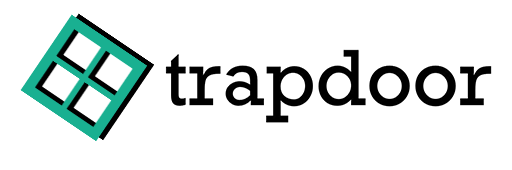

 
简体中文 |[English](./README_en.md)

## 这是什么

Trapdoor是一个为 Minecraft Bedrock Edition 服务的，基于原版服务端(BDS)的，致力于为原版玩家探索游戏机制服务的插件(或者mod)
,该插件的功能很大程度上参考了JE的[carpet](https://github.com/gnembon/fabric-carpet) 模组。

## 下载
[Releases](https://github.com/hhhxiao/TrapDoor/releases)
## 安装和使用教程

[Trapdoor Wiki](https://github.com/hhhxiao/TrapDoor/wiki)

## Credits

### Minecraft

感谢`mojang`提供的[Minecraft](https://www.minecraft.net/zh-hans)游戏

### 第三方库或者代码

- [https://github.com/microsoft/Detours](https://github.com/microsoft/Detours)

- [https://github.com/zhkj-liuxiaohua/MCMODDLL-CPP]( https://github.com/zhkj-liuxiaohua/MCMODDLL-CPP )

- [https://github.com/nlohmann/json](https://github.com/nlohmann/json)

- [https://github.com/DarthTon/Xenos](https://github.com/DarthTon/Xenos)

- [https://github.com/Celtoys/Remotery](https://github.com/Celtoys/Remotery)

- [https://github.com/progschj/ThreadPool](https://github.com/progschj/ThreadPool)

### 特别感谢

提供可读性极强的BDS源码的Player

### 玩家

感谢下面的玩家提供的优秀建议与反馈的bug:

- 木月酸与云龙碱
- 莵道三室戸
- orange_31
- SAC_Official
- panda4994万岁
- 梵蒂冈_273
- OEOTYAN
- Origin 0110
- 阿阎mr
- 玲珑芯
## 代码贡献者
<table>
  <tr>
    <td align="center"><a href="https://github.com/hhhxiao"> <b>AgNO3</b></a> <a href="https://github.com/hhhxiao/TrapDoor/commits?author=hhhxiao" title="Code">💻</a></td>
    <td align="center"><a href="https://github.com/OEOTYAN"> <b>OEOTYAN</b></a> <a href="https://github.com/hhhxiao/TrapDoor/commits?author=OEOTYAN" title="Code">💻</a></td>
    <td align="center"><a href="https://github.com/xiaohengying"> <b>xiaohengying</b></a> <a href="https://github.com/hhhxiao/TrapDoor/commits?author=xiaohengying" title="Code">💻</a></td>
    <td align="center"><a href="https://github.com/quizhizhe"> <b>Qiuzhizhe</b></a> <a href="https://github.com/hhhxiao/TrapDoor/commits?author=quizhizhe" title="Code">💻</a></td>
    <td align="center"><a href="https://github.com/0x506978656c"> <b>! Pixel</b></a> <a href="https://github.com/hhhxiao/TrapDoor/commits?author=0x506978656c" title="Code">💻</a></td>
    <td align="center"><a href="https://github.com/Sysca11"> <b>Sysca11</b></a> <a href="https://github.com/hhhxiao/TrapDoor/commits?author=0x506978656c" title="Code">💻</a></td>
  </tr>
</table>
## license
GPL v3
