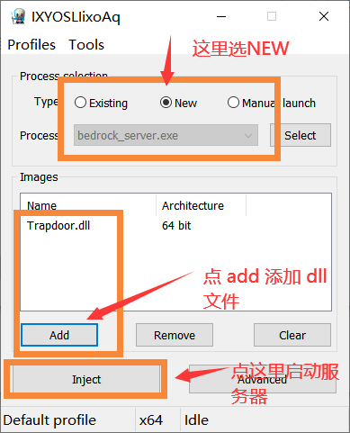

# 代码重构中...(code is in refactoring...)


```
  _  _    ___  _  _   
 | || |  / _ \| || |  
 | || |_| | | | || |_ 
 |__   _| | | |__   _|
    | | | |_| |  | |  
    |_|  \___/   |_|  
                      
                      
```


### 这是什么

 Trapdoor是一个为 Minecraft Bedrock Edition 服务的，基于原版服务端(BDS)的，致力于为原版玩家探索游戏机制服务的插件(或者mod),该插件的功能很大程度上参考了JE的[carpet](https://github.com/gnembon/fabric-carpet) 模组。

### 他能干什么

Trapdoor的功能还在持续开发中,目前又如下功能和特色:

#### 功能

- 暂停，加速，减速，步进和快进游戏运行
- 和`carpet`几乎同款的漏斗计数器
- 支持原版不显式支持的观察者模式
- 服务器性能分析，支持`mspt`和`tps`的计算以及各种更新的CPU占用，帮助你快速定位服务器卡顿原因
- 显示以及可视化村庄的相关信息，包括中心，边界，当前傀儡数和上限铁傀儡数，以及当前人口数和床数等等
- 仙人掌转方块(目前已经阉割，等待重写)
- 结构刷怪区域(HardcodedSpawnArea)的可视化
- 红石电路的信号源可视化，帮你快速掌握红石电路的本质
- 女巫小屋和海底神殿的多联查找(现已独立成独立的插件[https://github.com/hhhxiao/MCBEMulStructureFinder](https://github.com/hhhxiao/MCBEMulStructureFinder))
- 类似JE的`f3`功能，显示视角，区块坐标，史莱姆区块，群系，维度等等信息

#### 正在计划的功能

- 刷怪相关，包括当前区块内的实体统计和上限计算功能
- 距离测量功能
- 如果你有更好的功能或者创意欢迎在`issue`中提出

#### 特色

- 能几乎完全融入原版指令的指令系统
- 对多人游戏的良好支持
- 不会对存档造成任何破坏(前提是合理使用)

### 如何使用

####  1. 下载dll注入器

`release`中的文件只是单纯的`dll`文件，你**下载一个dll注入器才能启动游戏**，dll注入器你可以前往[https://github.com/DarthTon/Xenos/releases/tag/2.3.2](https://github.com/DarthTon/Xenos/releases/tag/2.3.2) 下载。

#### 2. 注入dll 并启动游戏

下载完后运行`Xenos64.exe`，剩下的看下图即可:



上面点`new`后会弹出窗口，选择服务端文件`bedrock_server.exe`即可。然后点`add`添加`dll`文件，最后点`Inject`启动服务器。

使用其它的注入器请自行探索用法,这里不再赘述。

#### 3.  如果你是运行的本地服务端(使用localhost连接)，那么请务必开启`Minecraft`的回环访问，用`powershell`运行如下命令即可:

   ```powershell
   CheckNetIsolation.exe LoopbackExempt –a –p=S-1-15-2-1958404141-86561845-1752920682-3514627264-368642714-62675701-73352043
   ```


### 功能介绍:

#### /tick

- `/tick fz` 暂停世界运行,包括区块加载，更新，实体更新，红石信号更新等等等行为。
- `/tick r` 恢复世界到正常状态
- `/tick slow num` 世界运行放慢num倍
- `/tick fw num` 步进n个游戏刻(如果tick数太多会导致客户端暂时没响应，请耐心等待，开始结束会有提示)
- `/tick acc num `和`slow`相反，会加速游戏运行`num`倍（注:请谨慎使用该功能，3-5倍即可，不需要开太多）

#### 性能分析

性能分析目前仅支持下面一个指令

- `/prof` 性能分析，显示红石，世界运行，随机刻更新，方块实体更新，刷怪等的时间占用以及mspt(统计100gt的数据，因此数据显示会有`2.5s`的延迟)(请在./tick r后执行，不然不准确)
- `/mspt`显示输入指令下一个`gt`的`mspt`和`tps`(注：因为游戏更新不是均匀进行的，比如漏斗只在某些游戏刻才更新，不同时候使用`mspt`造成的差异很大是正常现象)

#### /village

村庄相关目前有两个指令

- `/village list `列出正在ticking的村庄 村庄边界 村庄中心 村庄半径
- `/village show [true/false]` 开启/关闭村庄范围和中心的显示，爱心粒子是村庄中心，类结构方块风格的边框即为村庄边界

> 注意`list`是列出**在ticking的村庄，不是所有在加载区块内的村庄都会加载**，这个指令能直观地告诉你玩家在某个挂机点的时候刷帖机的核心数到底是多少，有多少个村子在有效更新。
>
> 村庄边界的格式: `center,radius,workded/population golem,bedPOI canSpawnGolem,bounds `边界矩形框两个对角线的坐标，中心是矩形框的中心，`radius`是村庄半径,`worked`是工作过的村民数,`population`是当前村庄的村民数,`goldem`是属于该村庄的铁傀儡数，`bedPOI`是村庄拥有(已和村民绑定的)床的数量。**为了达到良好的显示效果，请使用最新版的插件，并加载材质包**

#### 刷怪

> 这个功能在1.16.4版本中暂时被移除了

- `/actor start` 开始计数器，插件开始统计所有生成的生物
- `/actor end` 结束计数器
- `/actor p`打印统计结果，第一行是计时器经过的时间，第二行是各种生物的数量，第三行是刷怪点到玩家的距离(玩家打本条指令时的距离)分布(这一条好像数据有问题)，后面是每一行是每一个`y`值的刷怪数量
- `/actor info`列出一些刷怪信息，目前只有全局生物数量(大于小于200就不刷怪的那个数量)，如有更新会添加

#### 漏斗计数器

> 这个功能完全抄`carpet`的

一共有五个频道

- 钻石 0
- 绿宝石 1
- 铁 2
- 金 3
- 青金石 4

在你用`/func hc true`后，放在这些矿物块上的漏斗会变成无尽的漏斗，所有吸入的东西都没了，但是数据会保留下来.你可以用`/counter p channel`来查看这些漏斗吸收的物品数据,包括每种物品的个数和吸入平均速率。用`./counter reset channel`来重置某个频道的所有漏斗。`channel`选填`[0-4]`,如果你想增加频道,请修改`block/Hopper.cpp`中的`HOPPER_CHANNEL_MAP`,然含重新编译即可

#### 游戏模式

`trapdoor`提供了三个切换模式的快捷指令

- `/s` 切换为生存模式
- `/c`切换为创造模式
- `/o`切换为观察者模式

#### 测距

> 这个功能在1.16.4版本中暂时被移除了

在你使用`./func pm true`后，1.16新增的两种地狱菌类的木板会作为测距点，你挨个放置这两个方块的时候屏幕会显示这两个点之间欧式距离和曼哈顿距离，括号内的数据是忽略`y`的平面数据。
#### 显示HSA(HardCodedSpawnArea)

> ！这个功能有~~不太~~(比较)严重的BUG，显示的矩形框会串维度，如果你在某个地方发现了一堆黄色的框，请不要在意

使用 `/hsa show true/false` 来开启或者关闭HSA的显示，如果点位过多可能会造成卡顿，尤其是手机用户，请谨慎使用

#### 其它

- `/config pvd [distance]` 控制村庄显示时候的粒子显示范围 默认是128 
- `/func explosion [true/false]` 开启/关闭爆炸(tnt，苦力怕等)破坏方块
- `/tr?`会显示所有指令的帮助信息
- 任意的一级指令 + ` ?`可以显示该指令下的所有分支指令以及帮助

### 注意

- 退出游戏之前请调用`/tick r`，不然因为时钟同步问题还会显示你在线上但你进不去服务器，这样只能重启服务器解决
- 使用的时候原则上肯定不会对存档造成问题,但还是请备份
- 免责声明：如果本插件对你的存档造成损坏，概不负责，因此建议备份
- 任何问题欢迎加如入`1084326477`进行讨论

### 开发

欢迎提出`issue` ,作者在考虑后会采用或者解决

本项目目前还是个beta版，功能不够完善，代码也不够整洁和规范，还有很大的改进空间，欢迎您的pr,目前没有解决的问题在`todo.list`中(疯狂暗示).

### license 
GPL

### Credits

#### Minecfart
感谢`mojang`提供的[Minecraft](https://www.minecraft.net/zh-hans)游戏

#### 第三方库

- [https://github.com/microsoft/Detours](https://github.com/microsoft/Detours)

- [https://github.com/zhkj-liuxiaohua/MCMODDLL-CPP]( https://github.com/zhkj-liuxiaohua/MCMODDLL-CPP )

- [https://github.com/nlohmann/json](https://github.com/nlohmann/json)

- [https://github.com/DarthTon/Xenos](https://github.com/DarthTon/Xenos) 

#### 开发者
- Player
- [OEOTYAN](https://github.com/OEOTYAN)
#### 特别感谢
提供可读性极强的BDS源码的Player

#### 玩家
感谢下面的玩家提供的优秀建议与反馈的bug:
- 木月酸与云龙碱
- 莵道三室戸
- orange_31 
- SAC_Official
- panda4994万岁
- 梵蒂冈_273
- OEOTYAN
- Origin 0110
